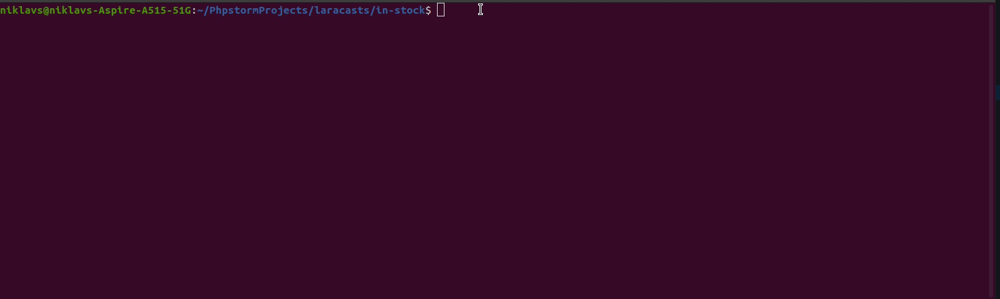

# Stock Tracker App

A simple console application that tracks the stock and price from 
retailers and notifies a user when the product is in stock.
This program is based on the Laracasts.com series ['Build A Stock Tracker App'](https://laracasts.com/series/build-a-stock-tracker-app).

##### Built with:
 - Laravel

## Getting Started

### Prerequisites

1. PHP 7.4 or above
2. Composer 1.10 or above
3. SQLite 2.8 or above (for testing purposes)
4. API keys from some retailer/s.

### Installation and Setup
1. Clone this repository from Github - `git clone https://github.com/NRaudseps/stock-tracker.git`.
2. Create a database named in_stock on MySQL or any DMS that you prefer.
3. Install Composer on the application `composer install`.
4. Copy the `.env.example` file and rename it `.env`.
5. Set up your .env file. You will have to add your retailer API keys at the very end of the file.
6. Run `php artisan migrate` to migrate tables to your database.
7. In the `retailers` table add the names of the retailers that you want to check
8. In the `products` table add the names of any products that you want to see.
9. In the `stock` table add the id's of the products and retailers from the previous tables.
Then for each product add the product `url` from the retailer's website, and the product `sku` (it should be visible
in the product page). You can set the `price` and `in_stock` to whatever you like. The application will update those
values.
10. Run `php artisan track`.

### Usage

If you want the application to notify you when a product is in stock set you email in the users table. 
The application when it detects the product is available it will email your notifying you.

### Acknowledgments
 - Laracasts.com - ['Build A Stock Tracker App'](https://laracasts.com/series/build-a-stock-tracker-app).
